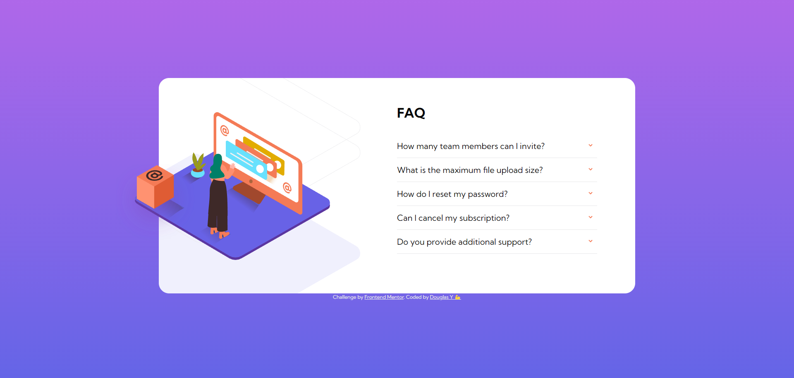
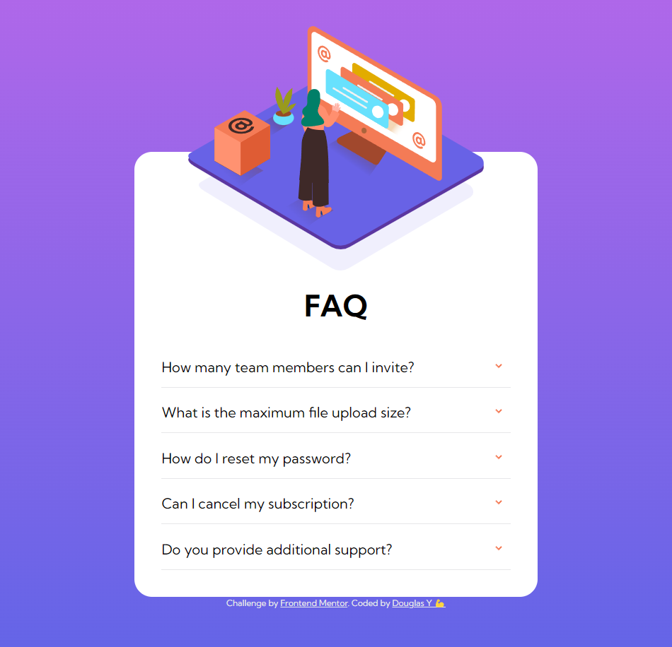

# Frontend Mentor - FAQ accordion card solution

This is a solution to the [FAQ accordion card challenge on Frontend Mentor](https://www.frontendmentor.io/challenges/faq-accordion-card-XlyjD0Oam). Frontend Mentor challenges help you improve your coding skills by building realistic projects. 

## Table of contents

- [Overview](#overview)
  - [The challenge](#the-challenge)
  - [Screenshot](#screenshot)
  - [Links](#links)
- [My process](#my-process)
  - [Built with](#built-with)
  - [What I learned](#what-i-learned)
- [Author](#author)


## Overview

### The challenge

Users should be able to:

- View the optimal layout for the component depending on their device's screen size
- See hover states for all interactive elements on the page
- Hide/Show the answer to a question when the question is clicked

### Screenshot




### Links

- Solution URL: [https://douglas-yokomizo.github.io/faq-accordion-card-main/]

## My process

### Built with

- Semantic HTML5 markup
- CSS custom properties
- Flexbox
- JavaScript

### What I learned

- I've learned how to better separate my elements in HTML
- How to make a simple accordion with javascript

```js
itensPerguntaERespostas.forEach(function (item) {
  item.addEventListener("click", function () {
    const itemMostrando = document.querySelector(".mostrar");

    if (itemMostrando) {
      itemMostrando.classList.remove("mostrar");
    }
    item.classList.add("mostrar");
  });
});
```

## Author

- Website - [Douglas Y.](https://www.linkedin.com/in/yogiyk)

